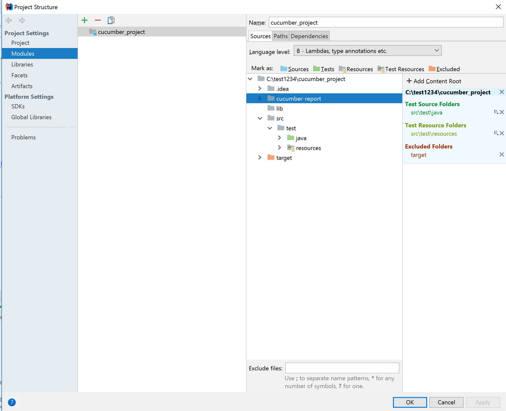

### Structure
* For running tests use [CucumberRunner.java](../master/src/test/java/runners/CucumberRunner.java)
* For step definition use [SampleSteps.java](../master/src/test/java/stepDefinitions/SampleSteps.java)

### Setup 
1. Clone Project:
   
   

2. In IDEA check in project structure, that:
    * Project settings:
      
    * Modules settings:
      
---
### GIT

[see Create a branch](CreateBranch.md)

[see Git add commit and push](GitAddCommitAndPush.md)

## When executing tests I see an error that I have version of Chrome XX, but driver supports Chrome YY

[Check your Chrome version (if link doesn't work google "chrome version check")](https://support.google.com/chrome/answer/95414)
Then go to [chrome driver download site (again if link doesn't work google "download chromedriver")](https://chromedriver.chromium.org/downloads) and download the version of driver which is correct for your browser version, which you checked before. 
Move replace the existing chrome driver in the `lib` folder with the one you just downloaded.

## In case you are running it on Mac
And you see error ""chromedriver" cannot be opened because the developer cannot be verified":

Open terminal, go into the "project folder"/lib. (So if you cloned it to /Users/username/code/selenium_java_basic, do:

`cd /Users/username/code/selenium_java_basic/lib`

And then execute:

`xattr -d com.apple.quarantine chromedriver`

